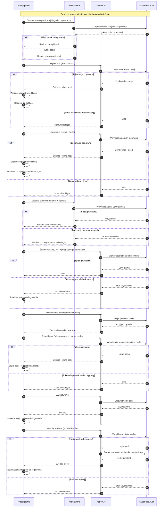

<mermaid_diagram>

```mermaid
sequenceDiagram
autonumber

participant Browser as Przeglądarka
participant Middleware as Middleware
participant API as Astro API
participant Auth as Supabase Auth

Note over Browser,Auth: Sesja po stronie klienta może być auto-odświeżana

Browser->>Middleware: Żądanie strony publicznej (login lub rejestracja)
activate Middleware
Middleware->>Auth: Sprawdzenie czy jest zalogowany
activate Auth
Auth-->>Middleware: Użytkownik lub brak sesji
deactivate Auth
alt Użytkownik zalogowany
  Middleware-->>Browser: Redirect do aplikacji
else Brak sesji
  Middleware-->>Browser: Render strony publicznej
end
deactivate Middleware

Browser->>API: Rejestracja (e-mail i hasło)
activate API
API->>Auth: Utworzenie konta i sesji
activate Auth
alt Rejestracja poprawna
  Auth-->>API: Użytkownik + sesja
  API-->>Browser: Sukces + dane sesji
  Browser-->>Browser: Zapis sesji po stronie klienta
  Browser-->>Browser: Redirect do aplikacji
else Konto istnieje lub błąd walidacji
  Auth-->>API: Błąd
  API-->>Browser: Komunikat błędu
end
deactivate Auth
deactivate API

Browser->>API: Logowanie (e-mail i hasło)
activate API
API->>Auth: Weryfikacja danych logowania
activate Auth
alt Logowanie poprawne
  Auth-->>API: Użytkownik + sesja
  API-->>Browser: Sukces + dane sesji
  Browser-->>Browser: Zapis sesji po stronie klienta
  Browser-->>Browser: Redirect do aplikacji lub redirect_to
else Nieprawidłowe dane
  Auth-->>API: Błąd
  API-->>Browser: Komunikat błędu
end
deactivate Auth
deactivate API

Browser->>Middleware: Żądanie strony chronionej w aplikacji
activate Middleware
Middleware->>Auth: Weryfikacja sesji użytkownika
activate Auth
alt Sesja poprawna
  Auth-->>Middleware: Użytkownik
  Middleware-->>Browser: Render strony chronionej
else Brak sesji lub sesja wygasła
  Auth-->>Middleware: Brak użytkownika
  Middleware-->>Browser: Redirect do logowania z redirect_to
end
deactivate Auth
deactivate Middleware

Browser->>API: Żądanie zasobu API wymagającego autoryzacji
activate API
API->>Auth: Weryfikacja tokenu użytkownika
activate Auth
alt Token poprawny
  Auth-->>API: Użytkownik
  API-->>Browser: Dane
else Token wygasł lub brak tokenu
  Auth-->>API: Brak użytkownika
  API-->>Browser: 401 i komunikat
  Browser-->>Browser: Przekierowanie do logowania
end
deactivate Auth
deactivate API

Browser->>API: Odzyskiwanie hasła (podanie e-mail)
activate API
API->>Auth: Inicjacja resetu hasła
activate Auth
Auth-->>API: Przyjęto żądanie
deactivate Auth
API-->>Browser: Zawsze komunikat sukcesu
deactivate API

Browser->>API: Reset hasła (token recovery + nowe hasło)
activate API
API->>Auth: Weryfikacja recovery i zmiana hasła
activate Auth
alt Token poprawny
  Auth-->>API: Nowa sesja
  API-->>Browser: Sukces + dane sesji
  Browser-->>Browser: Zapis sesji i redirect do aplikacji
else Token nieprawidłowy lub wygasły
  Auth-->>API: Błąd
  API-->>Browser: Komunikat błędu
end
deactivate Auth
deactivate API

Browser->>API: Wylogowanie
activate API
API->>Auth: Unieważnienie sesji
activate Auth
Auth-->>API: Wylogowano
deactivate Auth
API-->>Browser: Sukces
Browser-->>Browser: Usunięcie sesji i redirect do logowania
deactivate API

Browser->>API: Usunięcie konta (potwierdzenie)
activate API
API->>Auth: Weryfikacja użytkownika
activate Auth
alt Użytkownik zalogowany
  Auth-->>API: Użytkownik
  API->>Auth: Trwałe usunięcie konta jako administrator
  Auth-->>API: Konto usunięte
  API-->>Browser: 204 bez treści
  Browser-->>Browser: Sesja wygasa i redirect do logowania
else Brak autoryzacji
  Auth-->>API: Brak użytkownika
  API-->>Browser: 401 i komunikat
end
deactivate Auth
deactivate API
```

</mermaid_diagram>