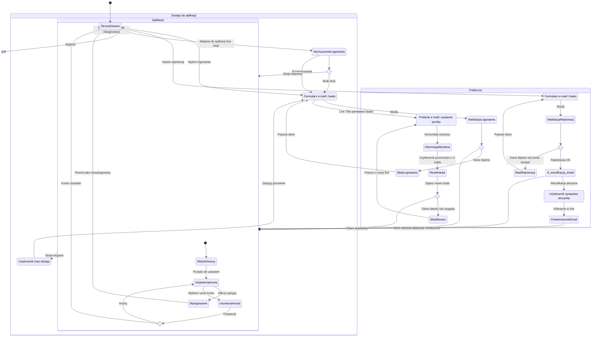

<mermaid_diagram>

```mermaid
stateDiagram-v2

[*] --> StronaGlowna

state "Publiczne" as Publiczne {
  StronaGlowna --> EkranLogowania: Wybór logowania
  StronaGlowna --> EkranRejestracji: Wybór rejestracji
  StronaGlowna --> Aplikacja: Wejście [użytkownik zalogowany]

  EkranLogowania: Formularz e-mail i hasło
  EkranRejestracji: Formularz e-mail i hasło

  EkranLogowania --> WalidacjaLogowania: Wyślij
  EkranRejestracji --> WalidacjaRejestracji: Wyślij

  state if_logowanie <<choice>>
  WalidacjaLogowania --> if_logowanie
  if_logowanie --> Aplikacja: Dane poprawne
  if_logowanie --> BladLogowania: Dane błędne

  state if_rejestracja <<choice>>
  WalidacjaRejestracji --> if_rejestracja
  if_rejestracja --> if_weryfikacja_email: Rejestracja OK
  if_rejestracja --> BladRejestracji: Dane błędne lub konto istnieje

  state if_weryfikacja_email <<choice>>
  if_weryfikacja_email --> Aplikacja: Weryfikacja nieaktywna
  if_weryfikacja_email --> OczekiwanieNaEmail: Weryfikacja aktywna

  OczekiwanieNaEmail: Użytkownik sprawdza skrzynkę
  OczekiwanieNaEmail --> PotwierdzenieEmail: Kliknięcie w link
  PotwierdzenieEmail --> Aplikacja: Konto aktywne

  EkranLogowania --> OdzyskiwanieHasla: Link "Nie pamiętam hasła"
  OdzyskiwanieHasla: Podanie e-mail i wysłanie prośby
  OdzyskiwanieHasla --> InformacjaWyslana: Komunikat sukcesu
  InformacjaWyslana --> ResetHasla: Użytkownik przechodzi z e-maila

  state if_reset <<choice>>
  ResetHasla --> if_reset: Zapisz nowe hasło
  if_reset --> Aplikacja: Token poprawny
  if_reset --> BladResetu: Token błędny lub wygasły

  BladLogowania --> EkranLogowania: Popraw dane
  BladRejestracji --> EkranRejestracji: Popraw dane
  BladResetu --> OdzyskiwanieHasla: Poproś o nowy link
}

state "Dostęp do aplikacji" as Dostep {
  state if_sesja <<choice>>
  WymuszenieLogowania --> if_sesja
  if_sesja --> EkranLogowania: Brak sesji
  if_sesja --> Aplikacja: Sesja aktywna

  SesjaWygasla: Użytkownik traci dostęp
  SesjaWygasla --> EkranLogowania: Zaloguj ponownie
}

state "Aplikacja" as Aplikacja {
  [*] --> WidokGlowny
  WidokGlowny --> UstawieniaKonta: Przejdź do ustawień

  UstawieniaKonta --> Wylogowanie: Kliknij wyloguj
  Wylogowanie --> StronaGlowna: Powrót jako niezalogowany

  UstawieniaKonta --> UsuniecieKonta: Wybierz usuń konto

  state if_usuniecie <<choice>>
  UsuniecieKonta --> if_usuniecie: Potwierdź
  if_usuniecie --> StronaGlowna: Konto usunięte
  if_usuniecie --> UstawieniaKonta: Anuluj
}

StronaGlowna --> WymuszenieLogowania: Wejście do aplikacji bez sesji
WymuszenieLogowania --> EkranLogowania: Przekierowanie

Aplikacja --> SesjaWygasla: Sesja wygasa

StronaGlowna --> [*]: Wyjście
```

</mermaid_diagram>