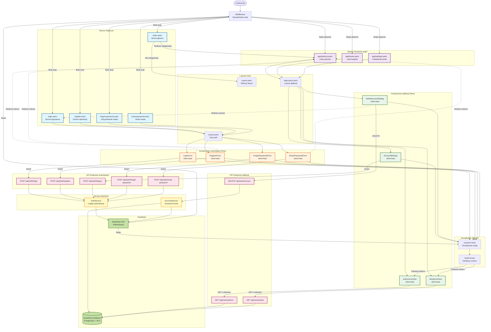

<mermaid_diagram>

```mermaid
flowchart TD
    Start([Użytkownik]) --> Middleware[Middleware<br/>Sprawdzanie sesji]
    
    subgraph "Strony Publiczne"
        Index[index.astro<br/>Strona główna]
        Login[login.astro<br/>Strona logowania]
        Register[register.astro<br/>Strona rejestracji]
        ForgotPass[forgot-password.astro<br/>Odzyskiwanie hasła]
        ResetPass[reset-password.astro<br/>Reset hasła]
    end
    
    subgraph "Komponenty Autentykacji React"
        LoginForm[LoginForm<br/>client:load]
        RegisterForm[RegisterForm<br/>client:load]
        ForgotForm[ForgotPasswordForm<br/>client:load]
        ResetForm[ResetPasswordForm<br/>client:load]
    end
    
    subgraph "Strony Chronione /app/*"
        AuthorsPage[app/authors.astro<br/>Lista autorów]
        BooksPage[app/books.astro<br/>Lista książek]
        SettingsPage[app/settings.astro<br/>Ustawienia konta]
    end
    
    subgraph "Komponenty Aplikacji React"
        AuthorsList[AuthorsListView<br/>client:load]
        BooksList[BooksListView<br/>client:load]
        AccountSettings[AccountSettings<br/>client:load]
        DeleteDialog[DeleteAccountDialog<br/>client:load]
    end
    
    subgraph "Layouty Astro"
        MainLayout[Layout.astro<br/>Główny layout]
        AuthLayout[Layout.astro<br/>Tryb auth]
        AppLayout[AppLayout.astro<br/>Layout aplikacji]
    end
    
    subgraph "Zarządzanie Stanem"
        AuthHook[useAuth Hook<br/>Zarządzanie sesją]
        AuthContext[AuthContext<br/>Globalny context]
    end
    
    subgraph "API Endpointy Autentykacji"
        API_Register[POST /api/auth/register]
        API_Login[POST /api/auth/login]
        API_Logout[POST /api/auth/logout]
        API_Forgot[POST /api/auth/forgot-password]
        API_Reset[POST /api/auth/reset-password]
    end
    
    subgraph "API Endpointy Aplikacji"
        API_Account[DELETE /api/user/account]
        API_Authors[GET /api/user/authors]
        API_Books[GET /api/user/books]
    end
    
    subgraph "Serwisy Backend"
        AuthService[AuthService<br/>Logika autentykacji]
        AccountService[AccountService<br/>Usuwanie konta]
    end
    
    subgraph "Supabase"
        SupabaseAuth[Supabase Auth<br/>Autentykacja]
        SupabaseDB[(Supabase Database<br/>PostgreSQL + RLS)]
    end
    
    Middleware -->|Brak sesji| Index
    Middleware -->|Brak sesji| Login
    Middleware -->|Brak sesji| Register
    Middleware -->|Brak sesji| ForgotPass
    Middleware -->|Brak sesji| ResetPass
    Middleware -->|Sesja aktywna| AuthorsPage
    Middleware -->|Sesja aktywna| BooksPage
    Middleware -->|Sesja aktywna| SettingsPage
    
    Index -->|Redirect zalogowany| AuthorsPage
    Index -->|Nie zalogowany| MainLayout
    
    Login --> AuthLayout
    Register --> AuthLayout
    ForgotPass --> AuthLayout
    ResetPass --> AuthLayout
    
    AuthLayout --> LoginForm
    AuthLayout --> RegisterForm
    AuthLayout --> ForgotForm
    AuthLayout --> ResetForm
    
    AuthorsPage --> AppLayout
    BooksPage --> AppLayout
    SettingsPage --> AppLayout
    
    AppLayout --> AuthorsList
    AppLayout --> BooksList
    AppLayout --> AccountSettings
    AppLayout --> DeleteDialog
    
    LoginForm --> AuthHook
    RegisterForm --> AuthHook
    ForgotForm --> AuthHook
    ResetForm --> AuthHook
    AccountSettings --> AuthHook
    DeleteDialog --> AuthHook
    
    AuthHook --> AuthContext
    AuthContext -->|Pobranie tokenu| AuthorsList
    AuthContext -->|Pobranie tokenu| BooksList
    
    LoginForm -->|POST| API_Login
    RegisterForm -->|POST| API_Register
    ForgotForm -->|POST| API_Forgot
    ResetForm -->|POST| API_Reset
    AccountSettings -->|POST| API_Logout
    DeleteDialog -->|DELETE| API_Account
    
    AuthorsList -->|GET z tokenem| API_Authors
    BooksList -->|GET z tokenem| API_Books
    
    API_Login --> AuthService
    API_Register --> AuthService
    API_Logout --> AuthService
    API_Forgot --> AuthService
    API_Reset --> AuthService
    API_Account --> AccountService
    
    AuthService --> SupabaseAuth
    AccountService --> SupabaseAuth
    AccountService --> SupabaseDB
    
    API_Authors --> SupabaseDB
    API_Books --> SupabaseDB
    
    SupabaseAuth -->|Sesja| AuthHook
    SupabaseAuth -->|Token| Middleware
    
    LoginForm -.->|Redirect sukces| AuthorsPage
    RegisterForm -.->|Redirect sukces| AuthorsPage
    ResetForm -.->|Redirect sukces| AuthorsPage
    DeleteDialog -.->|Redirect sukces| Login
    
    classDef authPage fill:#e1f5ff,stroke:#01579b,stroke-width:2px
    classDef authComponent fill:#fff3e0,stroke:#e65100,stroke-width:2px
    classDef appPage fill:#f3e5f5,stroke:#4a148c,stroke-width:2px
    classDef appComponent fill:#e8f5e9,stroke:#1b5e20,stroke-width:2px
    classDef api fill:#fce4ec,stroke:#880e4f,stroke-width:2px
    classDef service fill:#fff9c4,stroke:#f57f17,stroke-width:2px
    classDef supabase fill:#c5e1a5,stroke:#33691e,stroke-width:2px
    
    class Login,Register,ForgotPass,ResetPass,Index authPage
    class LoginForm,RegisterForm,ForgotForm,ResetForm authComponent
    class AuthorsPage,BooksPage,SettingsPage appPage
    class AuthorsList,BooksList,AccountSettings,DeleteDialog appComponent
    class API_Login,API_Register,API_Logout,API_Forgot,API_Reset,API_Account,API_Authors,API_Books api
    class AuthService,AccountService service
    class SupabaseAuth,SupabaseDB supabase
```

</mermaid_diagram>